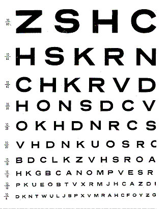
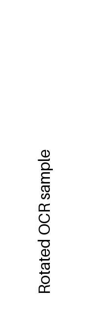
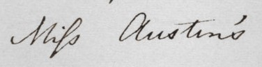
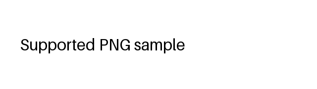

# API demo

Base URL: `https://api.ocr.lelbaba.top`

---

## 1. Clean printed text

```bash
curl -X POST -F 'image=@samples/normal.jpg;type=image/jpeg' \
  https://api.ocr.lelbaba.top/extract-text | jq
```

Input — `samples/normal.jpg`


`200`

```json
{
    "success": true,
    "text": "Flexbone OCR sample 123",
    "confidence": 0.9874678403139114,
    "processing_time_ms": 468
}
```

---

## 2. Metadata and normalized text

```bash
curl -X POST -F 'image=@test-images/english-eye-chart.jpg;type=image/jpeg' \
  'https://api.ocr.lelbaba.top/extract-text?metadata=true&normalize=true' | jq
```

Input — `test-images/english-eye-chart.jpg`



`200`

```json
{
    "success": true,
    "text": "22\n10\n50\nZSHC\nHSKRN\n*CHKRVD\nנו\n25\n의원\n15\nHON SDC V\nOKHDNRCS\nV HD NKUOSRC\nBDCLK Z VHS ROA\nHKGB CANOM PVESR\nPKUE OBTV XRM JHCAZDI\nDKNT WUL JSP XV MRAHCFOYZ G",
    "confidence": 0.9301613588963659,
    "processing_time_ms": 549,
    "normalized_text": "22\n10\n50\nZSHC\nHSKRN\n*CHKRVD\nנו\n25\n의원\n15\nHON SDC V\nOKHDNRCS\nV HD NKUOSRC\nBDCLK Z VHS ROA\nHKGB CANOM PVESR\nPKUE OBTV XRM JHCAZDI\nDKNT WUL JSP XV MRAHCFOYZ G",
    "metadata": {
        "width": 328,
        "height": 409,
        "byte_size": 36294,
        "color_mode": "RGB",
        "format": "JPEG"
    }
}
```

---

## 3. Rotated image

```bash
curl -X POST -F 'image=@samples/rotated.jpg;type=image/jpeg' \
  'https://api.ocr.lelbaba.top/extract-text?metadata=true' | jq
```

Input — `samples/rotated.jpg`



`200`

```json
{
    "success": true,
    "text": "Rotated OCR sample",
    "confidence": 0.9836493544280529,
    "processing_time_ms": 464,
    "metadata": {
        "width": 180,
        "height": 640,
        "byte_size": 7719,
        "color_mode": "RGB",
        "format": "JPEG"
    }
}
```

---

## 4. Handwriting

```bash
curl -X POST -F 'image=@test-images/english-handwriting.jpg;type=image/jpeg' \
  'https://api.ocr.lelbaba.top/extract-text?normalize=true' | jq
```

Input — `test-images/english-handwriting.jpg`



`200`

```json
{
    "success": true,
    "text": "Miss Austin's.",
    "confidence": 0.738329543517186,
    "processing_time_ms": 500,
    "normalized_text": "Miss Austin's."
}
```

---

## 5. Image with no text

```bash
curl -X POST -F 'image=@samples/blank.jpg;type=image/jpeg' \
  https://api.ocr.lelbaba.top/extract-text | jq
```

Input — `samples/blank.jpg`


`200`

```json
{
    "success": true,
    "text": "",
    "confidence": 0.0,
    "processing_time_ms": 157
}
```

---

## 6. Unsupported format

```bash
curl -X POST -F 'image=@samples/unsupported.bmp;type=image/bmp' \
  https://api.ocr.lelbaba.top/extract-text | jq
```

Input — `samples/unsupported.bmp` (BMP, 640×180, 345,654 bytes)

`415`

```json
{
    "success": false,
    "error": {
        "code": "unsupported_image_format",
        "message": "Only JPG/JPEG, PNG, and GIF images are supported."
    },
    "processing_time_ms": 3
}
```

---

## 7. Corrupt file

```bash
curl -X POST -F 'image=@samples/corrupt.jpg;type=image/jpeg' \
  https://api.ocr.lelbaba.top/extract-text | jq
```

Input — `samples/corrupt.jpg` (12 bytes, not a decodable image)

`422`

```json
{
    "success": false,
    "error": {
        "code": "corrupt_image",
        "message": "The image is corrupt or unreadable."
    },
    "processing_time_ms": 407
}
```

---

## 8. Missing image field

```bash
curl -X POST https://api.ocr.lelbaba.top/extract-text | jq
```

Input — none

`400`

```json
{
    "success": false,
    "error": {
        "code": "malformed_request",
        "message": "A valid multipart request with one 'image' field is required."
    },
    "processing_time_ms": 1
}
```

---

## 9. Batch of three images

```bash
curl -X POST \
  -F 'images=@samples/normal.jpg;type=image/jpeg' \
  -F 'images=@samples/rotated.jpg;type=image/jpeg' \
  -F 'images=@samples/supported.png;type=image/png' \
  'https://api.ocr.lelbaba.top/extract-text/batch?metadata=true&normalize=true' | jq
```

Input — `samples/normal.jpg`


Input — `samples/rotated.jpg`


Input — `samples/supported.png`



`200`

```json
{
    "success": true,
    "results": [
        {
            "index": 0,
            "status_code": 200,
            "success": true,
            "processing_time_ms": 275,
            "text": "Flexbone OCR sample 123",
            "confidence": 0.9875559538602829,
            "normalized_text": "Flexbone OCR sample 123",
            "metadata": {
                "width": 640,
                "height": 180,
                "byte_size": 9212,
                "color_mode": "RGB",
                "format": "JPEG"
            }
        },
        {
            "index": 1,
            "status_code": 200,
            "success": true,
            "processing_time_ms": 252,
            "text": "Rotated OCR sample",
            "confidence": 0.9836493544280529,
            "normalized_text": "Rotated OCR sample",
            "metadata": {
                "width": 180,
                "height": 640,
                "byte_size": 7719,
                "color_mode": "RGB",
                "format": "JPEG"
            }
        },
        {
            "index": 2,
            "status_code": 200,
            "success": true,
            "processing_time_ms": 757,
            "text": "Supported PNG sample",
            "confidence": 0.9805325170358022,
            "normalized_text": "Supported PNG sample",
            "metadata": {
                "width": 640,
                "height": 180,
                "byte_size": 5898,
                "color_mode": "RGB",
                "format": "PNG"
            }
        }
    ],
    "processing_time_ms": 759
}
```

---

## 10. Batch with partial failure

```bash
curl -X POST \
  -F 'images=@samples/normal.jpg;type=image/jpeg' \
  -F 'images=@samples/corrupt.jpg;type=image/jpeg' \
  -F 'images=@samples/unsupported.bmp;type=image/bmp' \
  https://api.ocr.lelbaba.top/extract-text/batch | jq
```

Input — `samples/normal.jpg`


Input — `samples/corrupt.jpg` (12 bytes, not a decodable image)

Input — `samples/unsupported.bmp` (BMP, 640×180, 345,654 bytes)

`200`

```json
{
    "success": true,
    "results": [
        {
            "index": 0,
            "status_code": 200,
            "success": true,
            "processing_time_ms": 251,
            "text": "Flexbone OCR sample 123",
            "confidence": 0.9875559538602829
        },
        {
            "index": 1,
            "status_code": 422,
            "success": false,
            "processing_time_ms": 2,
            "error": {
                "code": "corrupt_image",
                "message": "The image is corrupt or unreadable."
            }
        },
        {
            "index": 2,
            "status_code": 415,
            "success": false,
            "processing_time_ms": 1,
            "error": {
                "code": "unsupported_image_format",
                "message": "Only JPG/JPEG, PNG, and GIF images are supported."
            }
        }
    ],
    "processing_time_ms": 253
}
```

---

## 11. Health check

```bash
curl https://api.ocr.lelbaba.top/health
```

Input — none

`200`

```json
{
    "status": "ok"
}
```
