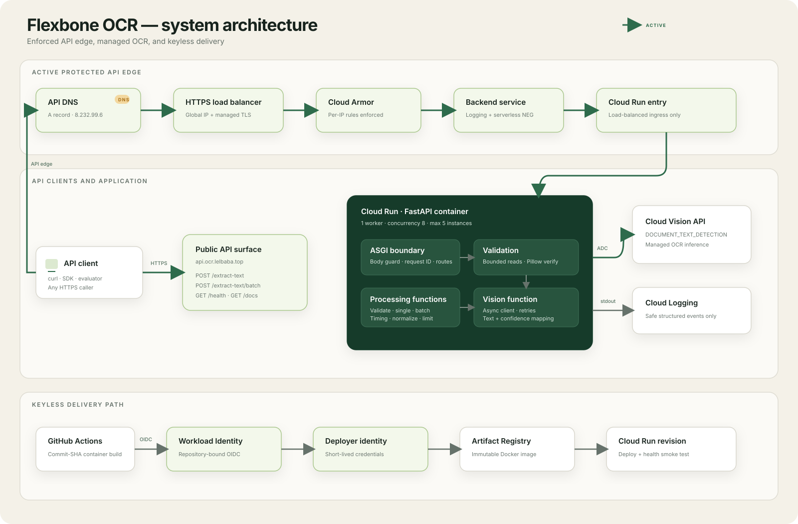
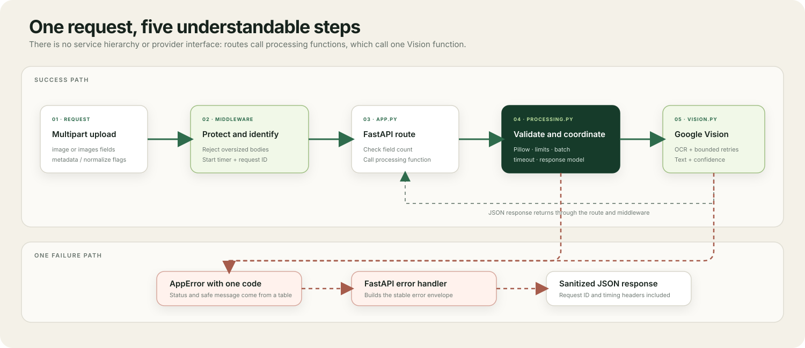

# Implementation deep dive

This document explains how Flexbone OCR is structured, why its tools were selected, how a request moves through the system, and where its boundaries are. For commands that create the cloud resources, see [Infrastructure setup](INFRASTRUCTURE.md).

## System architecture

The diagram distinguishes the active request path from the provisioned edge path that is still in preview.



Solid arrows are active production traffic. Dotted arrows are provisioned but not traffic-serving as of 2026-08-22: the load-balancer certificate is active and Cloud Armor rules are in preview, but `api.ocr.lelbaba.top` still resolves to Firebase Hosting and Cloud Run ingress still allows direct internet traffic.

### Logical request flow

Infrastructure concerns end at the ASGI boundary. Inside the container, every OCR request follows the same dependency direction:



The dependency direction is inward toward domain contracts. The application service knows the `OCRProvider` protocol, not the Google client implementation, which keeps business behavior testable without cloud credentials.

## Repository structure

```text
Flexbone/
├── src/ocr_service/
│   ├── app.py              FastAPI composition, routes, lifespan, error mapping
│   ├── config.py           Typed OCR_* environment settings
│   ├── domain.py           Provider port, value objects, response DTOs
│   ├── errors.py           Stable application error taxonomy
│   ├── middleware.py       Body limits, request IDs, Server-Timing
│   ├── service.py          Single and batch extraction use cases
│   ├── validation.py       Bounded reads and decoded image verification
│   └── vision.py           Asynchronous Google Vision adapter and retries
├── tests/                  Unit and HTTP contract tests with fake providers
├── hosting/                Static Firebase tester and human API guide
├── samples/                Generated functional fixtures
├── test-images/            Wider OCR quality and angle fixtures
├── scripts/
│   ├── bootstrap-gcp.sh    Core APIs, IAM, Artifact Registry, GitHub WIF
│   ├── bootstrap-edge.sh   Load balancer, certificate, NEG, Cloud Armor
│   └── deploy.sh           Local container build, push, and Cloud Run deploy
├── .github/workflows/      CI and manual production delivery
├── Dockerfile              Reproducible non-root runtime image
├── firebase.json           Static hosting and current Cloud Run rewrite
├── pyproject.toml          Dependencies and quality-tool configuration
└── uv.lock                 Reproducible dependency resolution
```

## Module responsibilities

| Module | Owns | Deliberately does not own |
|---|---|---|
| `app.py` | Process composition, routes, lifespan resources, dependency wiring, exception-to-HTTP mapping, safe completion logs | Image rules or Vision response interpretation |
| `config.py` | Validated defaults and `OCR_` environment overrides | Secret storage; the service uses Application Default Credentials |
| `domain.py` | `OCRProvider` protocol, internal value objects, Pydantic response contracts | Google-specific classes or HTTP route logic |
| `errors.py` | Public error codes, safe messages, and status codes | Vendor error text, stack traces, or logging policy |
| `middleware.py` | Early request-body rejection, correlation IDs, and `Server-Timing` | OCR orchestration |
| `validation.py` | Bounded byte reads, supported decoded formats, corruption checks, dimension limits, safe metadata | OCR or text cleanup |
| `service.py` | Use-case timing, provider invocation, normalization, batch ordering, concurrency and timeout policy | HTTP parsing or Google SDK details |
| `vision.py` | Vision request construction, retry classification, canonical text extraction, confidence calculation, client shutdown | Upload validation or response serialization |

## Design patterns

### Ports and adapters

`OCRProvider` is the domain port. `GoogleVisionProvider` is its infrastructure adapter. `ExtractTextService` accepts the port through constructor injection, so tests substitute a small in-memory fake. This avoids importing or monkey-patching Google SDK behavior in application tests and leaves room for another OCR engine only if a real requirement appears.

### Application service / use case

`ExtractTextService` represents one single-image extraction. It sequences validation, OCR, timing, optional normalization, and response construction. `ExtractBatchService` composes the single-image operation while adding batch-specific limits, ordering, partial failure, concurrency, and deadline behavior. Routes remain transport adapters rather than accumulating business rules.

### Constructor dependency injection

`create_app()` accepts a provider factory and optional settings. Production creates one asynchronous Vision client during FastAPI lifespan; tests pass a fake provider. This provides the useful part of dependency injection without a container framework or global mutable singleton.

### Strategy

The provider protocol is also a Strategy boundary: the extraction service can invoke any conforming OCR strategy. Only Google Vision is implemented because a second adapter without a real use case would add maintenance without value.

### Central error translation

Validation and infrastructure layers raise typed `AppError` subclasses. Global FastAPI handlers convert those errors, FastAPI validation failures, Starlette HTTP errors, and unexpected exceptions into one public JSON envelope. Google exception messages never cross the boundary.

### Bulkheads

The service limits pressure at several levels:

- Request bodies are bounded before multipart parsing can consume uncontrolled memory.
- Each image is limited to 10 MiB and 40 megapixels decoded.
- A batch contains at most five images and 25 MiB of image data.
- Only two Vision operations run concurrently inside one batch.
- Cloud Run handles at most eight requests per instance and scales to at most five instances.
- The staged Cloud Armor policy limits requests per source IP at the edge.

These are practical cost and memory boundaries, not guarantees of fair use or protection from a distributed attack.

## Why these tools and libraries

| Choice | Why it fits | Main tradeoff |
|---|---|---|
| Python 3.12 | Strong async ecosystem, type annotations, mature Google client libraries, and fast delivery for a compact service | CPU-heavy image transformations would need careful profiling or native workers |
| FastAPI | Native ASGI, typed request/response integration, lifespan hooks, dependency-friendly app factories, and OpenAPI generation | Multipart parsing still needs explicit body guards and default validation errors need translation |
| Pydantic and Pydantic Settings | One typed definition for public DTO validation and environment configuration | Models add a serialization layer and settings lists/complex values need deliberate environment encoding |
| Google Cloud Vision | Managed OCR handles rotation, poor images, documents, and handwriting without maintaining OCR models. `DOCUMENT_TEXT_DETECTION` exposes page/block/paragraph/word/symbol hierarchy used for confidence | Network dependency, quotas, per-unit cost, vendor coupling, and nondeterministic model output |
| `ImageAnnotatorAsyncClient` | Does not block the ASGI event loop while waiting on Vision; one client is reused for connection pooling | Async lifecycle and retry cancellation require more care than a one-shot synchronous client |
| Pillow | Decodes actual content, identifies format independently of filename/MIME, verifies corruption, and exposes dimensions/mode without external binaries | Decoding untrusted images requires explicit byte and decompression limits |
| Uvicorn | Small production ASGI server, supports graceful process shutdown, and honors Cloud Run's `$PORT` | One worker means capacity is managed through async concurrency and Cloud Run scaling rather than local multiprocessing |
| `uv` and `uv.lock` | Fast, exact environment synchronization and a committed cross-platform lockfile; the same resolver is used locally, in CI, and in Docker | Team members must install `uv` instead of using only stock `pip` |
| Ruff | One fast tool covers formatting, import order, and common correctness rules | It intentionally does not replace deep type or semantic analysis |
| mypy strict mode | Checks protocol conformance and layer boundaries before runtime | Third-party libraries with incomplete typing need narrowly scoped overrides |
| pytest, pytest-asyncio, HTTPX/TestClient | Tests async services, HTTP contracts, middleware, concurrency, and failure mapping without a running server | The fake provider cannot prove real Vision quality; that needs opt-in integration tests |
| Docker multi-stage build | Produces a repeatable, minimal runtime with no compiler or development dependencies and runs as a non-root user | Container builds are slower than direct source deployment and base images must be maintained |
| Cloud Run | Stateless HTTPS container hosting, scale-to-zero, revision rollbacks, managed identity, and configurable concurrency/instance ceilings | Cold starts, request-duration limits, and no local durable state |
| Artifact Registry | Regional immutable image storage integrated with Cloud Run and Google IAM | Storage and network usage can incur cost; old images need lifecycle management |
| GitHub Actions + WIF | Builds each commit in a clean runner and exchanges GitHub OIDC identity for short-lived Google credentials instead of storing a JSON key | IAM/OIDC setup is more involved than a long-lived key and repository claim constraints must be correct |
| Firebase Hosting | Simple global static hosting, managed TLS, custom domains, and no frontend build pipeline | The current Cloud Run rewrite can bypass a separately staged Cloud Armor edge until the final cutover |
| External Application Load Balancer + Cloud Armor | Provides a fixed anycast IP, managed TLS termination, centralized logs, and distributed per-IP throttling before Cloud Run | Adds fixed monthly cost, DNS/certificate setup, and more infrastructure than the evaluator-scale API strictly needs |

Google documents `DOCUMENT_TEXT_DETECTION` as the OCR mode optimized for dense text and document hierarchy in the [Vision OCR guide](https://docs.cloud.google.com/vision/docs/ocr). `uv`'s lock/sync behavior is described in its [project synchronization guide](https://docs.astral.sh/uv/concepts/projects/sync/). Google recommends WIF for deployment pipelines to avoid service-account keys in the [pipeline federation guide](https://docs.cloud.google.com/iam/docs/workload-identity-federation-with-deployment-pipelines).

## Request processing

### Single image

1. `RequestBodyLimitMiddleware` checks `Content-Length` when present and also counts streamed ASGI body chunks, so chunked requests cannot evade the limit.
2. FastAPI parses the multipart body into an `UploadFile`. The route rejects missing or duplicate `image` fields.
3. `read_validated_image()` reads 64 KiB chunks and stops at the first byte over the configured limit.
4. Pillow opens bytes from memory, checks the decoded format, checks `width × height`, captures safe metadata, and calls `verify()` to detect corruption.
5. `ExtractTextService` sends the unchanged validated bytes to the provider. It does not recompress the image or write it to application-managed storage.
6. The Vision adapter submits one `DOCUMENT_TEXT_DETECTION` feature and maps the canonical `full_text_annotation.text`.
7. The service optionally normalizes Unicode, line endings, and repeated horizontal whitespace in a separate field; raw OCR text remains untouched.
8. Pydantic serializes the stable success response. Middleware adds `X-Request-ID` and `Server-Timing`.

The `UploadFile` may use Starlette's temporary spooling while multipart data is parsed, but application code never creates a persistent image file. Both validation and batch cleanup close uploads on success and failure paths.

### Batch

1. The route requires one to five repeated `images` fields.
2. Known upload sizes are checked before decoding; measured validated sizes are checked again.
3. Every image is validated independently. Validation failures become ordered per-item results.
4. Valid images are processed behind an `asyncio.Semaphore(2)`.
5. Results are written into preallocated positions, preserving input order even when operations complete out of order.
6. A 50-second `asyncio.timeout()` applies to the whole batch. Unfinished tasks are cancelled and mapped to per-item `504` results.
7. A structurally valid batch returns HTTP `200`; clients inspect each item's `success` and `status_code`.

This partial-success contract prevents one corrupt image from discarding unrelated successful OCR work.

## Confidence calculation

Vision returns confidence at word level and exposes the number of symbols in each word. The adapter calculates a symbol-count-weighted mean:

```text
confidence = Σ(word confidence × symbol count) / Σ(symbol count)
```

Longer words therefore contribute proportionally more than one-character words. The result is clamped to `[0.0, 1.0]`. Missing text or missing confidence yields `0.0` rather than inventing certainty.

## Retry and timeout policy

One initial Vision request can be followed by at most two retries. `ServiceUnavailable` and internal server errors are retried with bounded exponential backoff plus jitter. Deadline errors are retried until the attempt budget is exhausted, then become `ocr_deadline_exceeded`. Quota exhaustion and too-many-request failures are surfaced immediately as `ocr_unavailable`; retrying them inside the same request would amplify pressure. Authentication and invalid-request errors are not classified as retryable.

The roughly 20-second deadline is applied per attempt by the Google client. The outer Cloud Run timeout is 60 seconds, and the batch use case imposes a shorter 50-second budget so the application can still return a controlled response.

## Lifecycle and resource model

FastAPI lifespan creates exactly one `ImageAnnotatorAsyncClient` per Uvicorn process and closes its transport during graceful shutdown. Cloud Run runs one worker, so there is one reusable client per instance. This avoids reconnecting on every request and makes ownership explicit.

At configured maxima, one instance may receive eight concurrent HTTP requests. A single request can retain up to 10 MiB of source bytes; a batch can retain up to 25 MiB plus decoded-image/library overhead. The 512 MiB instance limit is intentionally conservative for current traffic but should be load-tested before increasing batch frequency or Cloud Run concurrency.

## Observability and privacy

- Every response gets an `X-Request-ID`; a client-supplied ID is accepted only up to 128 characters.
- `Server-Timing` reports application time to clients.
- Completion logs contain event name, status, latency, retry count, and batch counts.
- Failure logs contain only a safe error class; unexpected errors retain server-side stack traces.
- Image bytes, filenames, OCR text, EXIF, and user-provided metadata are not logged.
- There is no database, object store, queue, cache, or analytics pipeline in the application path.

Cloud Logging captures container stdout/stderr. Correlation IDs are response headers today; they are not yet injected into every structured log event, which is a known observability improvement.

## Testing strategy

The app factory and provider port keep ordinary tests offline:

- API tests lock success/error envelopes, headers, OpenAPI, options, and multipart edge cases.
- Validation tests cover the exact byte boundary, first byte over, corruption, decoded dimensions, and content/extension mismatch.
- Service tests cover normalization and timing.
- Batch tests cover ordering, partial failures, combined limits, two-call concurrency, timeout cancellation, and provider failures.
- Vision tests cover weighted confidence, empty annotations, response mapping, and client shutdown.
- CI runs lock verification, Ruff formatting/lint, strict mypy, pytest with an 85% coverage gate, Docker build, and container import smoke testing.

The current fake-provider suite verifies deterministic behavior but does not replace opt-in real-project OCR quality tests for rotation, handwriting, poor contrast, or multilingual images.

## Limitations and non-goals

- The service is unauthenticated and public. It has no user accounts, API keys, per-customer quotas, or audit ownership.
- Current API traffic bypasses the staged Cloud Armor load balancer through Firebase Hosting; rate rules are preview-only until DNS and ingress are cut over.
- Per-IP rate limits cannot distinguish users behind a shared NAT and can be distributed across many source IPs.
- No result cache exists, so identical images consume another Vision unit.
- There is no durable job state. Batch requests are synchronous and limited to five images.
- Text language is not forced; the project test scope is English, but Vision may infer other languages.
- GIF processing considers only the first frame.
- Orientation correction, deskewing, denoising, contrast enhancement, and recompression are delegated to Vision; original bytes are sent unchanged.
- Metadata intentionally excludes EXIF, GPS, camera model, and other identifying fields.
- OCR quality and confidence are provider estimates, not guarantees of correctness.
- The application does not perform malware scanning; it only decodes supported image formats under bounded size/dimension rules.
- Cloud Run scale-to-zero can introduce a cold-start delay.
- The external load balancer and Cloud Armor add fixed cost once made authoritative, even at low traffic.

## What was intentionally avoided

There is no repository abstraction because there is no persistence. There is no event bus, queue, factory hierarchy, DI framework, microservice split, or second OCR adapter because none currently solves a real requirement. The modular monolith keeps boundaries visible while allowing one process, one deployment unit, and straightforward local tests.

Future features should introduce infrastructure only when their requirements demand it—for example, Firestore for a versioned OCR cache, object storage and a queue for asynchronous large jobs, or authentication when per-user quotas or private documents become necessary.
