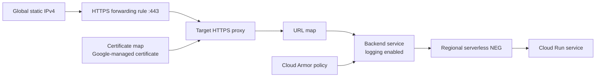

# Infrastructure setup

This runbook creates Flexbone OCR from an empty Google Cloud project and connects it to GitHub, Firebase Hosting, Cloud Run, Cloud Vision, and optional edge rate limiting. Commands assume Bash and are written so values are supplied through explicit variables.

There are two deployment milestones:

1. **Working baseline:** Firebase serves the frontend and proxies API paths to a public Cloud Run service. This is the active production topology as of 2026-08-22.
2. **Hardened edge:** a global external Application Load Balancer and Cloud Armor become the only public API path. The resources are currently provisioned with preview rules, but DNS and Cloud Run ingress have not been cut over.

Stop at the end of [Baseline acceptance](#9-baseline-acceptance) to reproduce the current working release. The later sections explain the staged edge resources and the conditions required for a safe final cutover.

## 1. Understand the resources and cost

The baseline creates:

- One billing-enabled Google Cloud project
- Enabled Cloud Run, Vision, Artifact Registry, IAM Credentials, Security Token Service, Service Usage, and Resource Manager APIs
- One regional Artifact Registry Docker repository
- One dedicated Cloud Run runtime service account
- One dedicated GitHub deployment service account
- One GitHub Workload Identity Pool and OIDC provider
- One Cloud Run service
- One Firebase Hosting site and managed certificates for its custom domains

The optional edge adds:

- One global static IPv4 address
- One global external managed HTTPS load balancer
- One serverless network endpoint group (NEG)
- One backend service with request logging
- One Certificate Manager DNS authorization, certificate, certificate map, and map entry
- One Cloud Armor policy with per-IP throttle rules

Cloud Run, Vision, Artifact Registry, Firebase, the load balancer, Certificate Manager, and Cloud Armor have independent quotas and pricing. A load balancer and Cloud Armor can add fixed charges even at very low traffic; Google notes that normal load-balancer charges apply to serverless NEG backends in the [load-balancer pricing documentation](https://cloud.google.com/load-balancing/pricing). A Cloud Billing budget sends alerts but is not a hard spending cap. Review current pricing and set project quotas before exposing the service.

## 2. Prerequisites

You need:

- A Google account permitted to create projects and attach a billing account
- A GitHub account and repository
- A domain whose DNS records you can edit
- Git
- Python 3.12
- [`uv`](https://docs.astral.sh/uv/getting-started/installation/)
- [Google Cloud CLI](https://cloud.google.com/sdk/docs/install)
- [Docker Engine or Docker Desktop](https://docs.docker.com/engine/install/)
- [GitHub CLI](https://cli.github.com/)
- [Firebase CLI](https://firebase.google.com/docs/cli)
- `jq`, `curl`, and `dig`

Confirm the tools:

```bash
git --version
python3 --version
uv --version
gcloud --version
docker version
gh --version
firebase --version
jq --version
```

Authenticate the three CLIs:

```bash
gcloud auth login
gcloud auth application-default login
gh auth login
firebase login
```

Application Default Credentials are for local Vision calls. The deployed container does not contain those credentials; Cloud Run supplies credentials for its runtime service identity.

## 3. Choose identifiers

Set these once in each shell used during setup:

```bash
export PROJECT_ID='your-globally-unique-project-id'
export PROJECT_NAME='Flexbone OCR'
export REGION='asia-south1'
export GITHUB_REPOSITORY='owner/repository'
export REPOSITORY='flexbone'
export SERVICE='flexbone-ocr'
export FRONTEND_DOMAIN='ocr.example.com'
export API_DOMAIN='api.ocr.example.com'
```

`PROJECT_ID` is immutable after project creation. Keep the Cloud Run region and Artifact Registry region the same. The repository scripts default to `asia-south1`, repository `flexbone`, and service `flexbone-ocr`; using other values requires passing the same environment variables consistently and changing the region in `firebase.json`.

## 4. Create the project, billing, and budget

If the project does not exist:

```bash
gcloud projects create "$PROJECT_ID" --name "$PROJECT_NAME"
gcloud config set project "$PROJECT_ID"
```

List billing accounts and attach one:

```bash
gcloud billing accounts list
gcloud billing projects link "$PROJECT_ID" --billing-account BILLING_ACCOUNT_ID
gcloud billing projects describe "$PROJECT_ID"
```

Before enabling paid APIs, open **Google Cloud Console → Billing → Budgets & alerts**, select the new project, and create a small monthly budget with alerts at 50%, 90%, and 100%. Add an email notification channel you actively monitor. Budget alerts do not stop services automatically.

Select the project again after any account-level operation:

```bash
gcloud config set project "$PROJECT_ID"
gcloud auth application-default set-quota-project "$PROJECT_ID"
```

## 5. Clone and verify locally

```bash
git clone git@github.com:Lelbaba/Flexbone.git
cd Flexbone
uv sync --frozen
uv lock --check
uv run ruff format --check .
uv run ruff check .
uv run mypy
uv run pytest
docker build -t flexbone-ocr:local .
```

The ordinary test suite injects a fake OCR provider, so it should pass before Vision or Cloud Run is configured.

For a real local OCR call, enable Vision and start Uvicorn:

```bash
gcloud services enable vision.googleapis.com --project "$PROJECT_ID"
uv run uvicorn ocr_service.app:app --reload
```

In another terminal:

```bash
curl -F 'image=@samples/normal.jpg;type=image/jpeg' \
  http://localhost:8000/extract-text
```

## 6. Bootstrap core Google Cloud resources

Run the idempotent bootstrap script:

```bash
PROJECT_ID="$PROJECT_ID" \
REGION="$REGION" \
REPOSITORY="$REPOSITORY" \
GITHUB_REPOSITORY="$GITHUB_REPOSITORY" \
bash scripts/bootstrap-gcp.sh | tee /tmp/flexbone-bootstrap-gcp.out
```

It performs the following operations:

1. Enables Cloud Run, Artifact Registry, Vision, IAM Credentials, Security Token Service, Service Usage, and Resource Manager APIs.
2. Creates the regional Docker repository.
3. Creates `ocr-runtime@PROJECT_ID.iam.gserviceaccount.com`.
4. Grants the runtime identity `roles/serviceusage.serviceUsageConsumer`, allowing requests to consume enabled project services/quota.
5. Creates `ocr-deployer@PROJECT_ID.iam.gserviceaccount.com`.
6. Grants the deployer repository-scoped Artifact Registry Writer, project Cloud Run Admin, and Service Account User only on the runtime identity.
7. Creates a `github-actions` workload identity pool and `github` OIDC provider constrained to the exact `owner/repository` claim.
8. Allows that repository identity to impersonate the deployment service account.
9. Prints `WIF_PROVIDER` and `DEPLOY_SERVICE_ACCOUNT`.

The runtime and deployment identities are deliberately separate. Cloud Run uses the runtime account to call Vision; GitHub uses the deployer only to push and deploy. Google describes Cloud Run service identities in its [service identity guide](https://docs.cloud.google.com/run/docs/configuring/services/service-identity) and recommends short-lived WIF credentials for pipelines in the [deployment pipeline guide](https://docs.cloud.google.com/iam/docs/workload-identity-federation-with-deployment-pipelines).

Verify the created resources:

```bash
gcloud artifacts repositories describe "$REPOSITORY" --location "$REGION"
gcloud iam service-accounts describe "ocr-runtime@$PROJECT_ID.iam.gserviceaccount.com"
gcloud iam service-accounts describe "ocr-deployer@$PROJECT_ID.iam.gserviceaccount.com"
gcloud iam workload-identity-pools providers describe github \
  --project "$PROJECT_ID" \
  --location global \
  --workload-identity-pool github-actions
```

### IAM summary

| Principal | Scope | Role | Reason |
|---|---|---|---|
| Runtime service account | Project | `roles/serviceusage.serviceUsageConsumer` | Consume enabled APIs and project quota |
| Deployment service account | Artifact Registry repository | `roles/artifactregistry.writer` | Push immutable images |
| Deployment service account | Project | `roles/run.admin` | Create revisions and update traffic |
| Deployment service account | Runtime service account | `roles/iam.serviceAccountUser` | Attach the runtime identity to Cloud Run |
| GitHub repository principal set | Deployment service account | `roles/iam.workloadIdentityUser` | Exchange repository OIDC identity for short-lived deployer credentials |

No service-account JSON key is created or stored.

## 7. Configure GitHub Actions and deploy Cloud Run

Capture the script output:

```bash
export WIF_PROVIDER="$(sed -n 's/^WIF_PROVIDER=//p' /tmp/flexbone-bootstrap-gcp.out)"
export DEPLOY_SERVICE_ACCOUNT="$(sed -n 's/^DEPLOY_SERVICE_ACCOUNT=//p' /tmp/flexbone-bootstrap-gcp.out)"
```

Create the production environment and repository variables:

```bash
gh api --method PUT "repos/$GITHUB_REPOSITORY/environments/production"
gh variable set GCP_PROJECT_ID --repo "$GITHUB_REPOSITORY" --body "$PROJECT_ID"
gh variable set GCP_REGION --repo "$GITHUB_REPOSITORY" --body "$REGION"
gh variable set WIF_PROVIDER --repo "$GITHUB_REPOSITORY" --body "$WIF_PROVIDER"
gh variable set DEPLOY_SERVICE_ACCOUNT --repo "$GITHUB_REPOSITORY" \
  --body "$DEPLOY_SERVICE_ACCOUNT"
gh variable list --repo "$GITHUB_REPOSITORY"
```

Push the repository's `main` branch, confirm CI succeeds, then start the manual production workflow:

```bash
git push origin main
gh workflow run deploy.yml --repo "$GITHUB_REPOSITORY" --ref main
sleep 3
export DEPLOY_RUN_ID="$(gh run list \
  --repo "$GITHUB_REPOSITORY" \
  --workflow deploy.yml \
  --limit 1 \
  --json databaseId \
  --jq '.[0].databaseId')"
gh run watch "$DEPLOY_RUN_ID" --repo "$GITHUB_REPOSITORY" --exit-status
```

The workflow:

1. Obtains a GitHub OIDC token.
2. Exchanges it through WIF to impersonate `ocr-deployer`.
3. Builds the Dockerfile.
4. Tags the image with the immutable Git commit SHA.
5. Pushes it to Artifact Registry.
6. Deploys one CPU, 512 MiB, concurrency 8, min instances 0, max instances 5, and a 60-second request timeout.
7. Assigns the dedicated runtime service account.
8. Calls `/health` on the resulting service URL.

Inspect the result:

```bash
export CLOUD_RUN_URL="$(gcloud run services describe "$SERVICE" \
  --project "$PROJECT_ID" \
  --region "$REGION" \
  --format='value(status.url)')"
curl "$CLOUD_RUN_URL/health"
curl -F 'image=@samples/normal.jpg;type=image/jpeg' \
  "$CLOUD_RUN_URL/extract-text"
```

For a local manual deployment instead of GitHub Actions:

```bash
PROJECT_ID="$PROJECT_ID" REGION="$REGION" REPOSITORY="$REPOSITORY" \
SERVICE="$SERVICE" bash scripts/deploy.sh
```

This fallback uses your local Docker and gcloud credentials; it is not the normal production path.

## 8. Configure Firebase Hosting and custom domains

Add Firebase resources to the existing Google Cloud project:

```bash
firebase projects:addfirebase "$PROJECT_ID"
```

If the project is already Firebase-enabled, the command can report that no change is needed. Confirm `firebase.json` points to the correct Cloud Run service and region. Its active rewrite sends unmatched Hosting paths to `flexbone-ocr` in `asia-south1`; edit those values before deployment if you chose different identifiers.

Deploy the six static assets under `hosting/`:

```bash
firebase deploy --only hosting --project "$PROJECT_ID"
```

Verify the default Hosting URL:

```bash
curl --compressed "https://$PROJECT_ID.web.app/" | grep 'Flexbone OCR'
curl "https://$PROJECT_ID.web.app/health"
```

The first request is served from static Hosting. `/health`, `/extract-text`, `/extract-text/batch`, `/openapi.json`, and `/docs` have no matching static file, so the catch-all rewrite forwards them to Cloud Run.

### Frontend custom domain

In **Firebase Console → Hosting → Add custom domain**:

1. Select the default Hosting site.
2. Enter `FRONTEND_DOMAIN` (for example, `ocr.example.com`).
3. Add the exact DNS ownership/certificate record Firebase displays.
4. Replace any parked wildcard result with the exact CNAME Firebase requests, normally `FRONTEND_DOMAIN → PROJECT_ID.web.app`.
5. Keep the ACME TXT record after activation so Firebase can renew HTTPS automatically.
6. Wait until Hosting reports `HOST_ACTIVE`, ownership is active, and the certificate is active.

Verify:

```bash
dig +short CNAME "$FRONTEND_DOMAIN"
curl --compressed "https://$FRONTEND_DOMAIN/" | grep 'Flexbone OCR'
```

### Baseline API custom domain

Repeat the Firebase custom-domain process for `API_DOMAIN`. In the baseline topology both custom domains point to the same Hosting site. Static files are available at either hostname, while API paths are forwarded through the Cloud Run rewrite.

Verify:

```bash
dig +short CNAME "$API_DOMAIN"
curl "https://$API_DOMAIN/health"
curl -F 'image=@samples/normal.jpg;type=image/jpeg' \
  "https://$API_DOMAIN/extract-text"
curl -I "https://$API_DOMAIN/docs"
```

The final command should return a `307` redirect to the human API guide on the frontend domain. If a newly activated custom domain shows Firebase's stale “Site Not Found” page only for browsers, redeploy Hosting once to invalidate compressed CDN variants:

```bash
firebase deploy --only hosting --project "$PROJECT_ID"
```

## 9. Baseline acceptance

Run this matrix before considering the baseline complete:

```bash
curl --fail "https://$API_DOMAIN/health"

curl --fail \
  -F 'image=@samples/normal.jpg;type=image/jpeg' \
  "https://$API_DOMAIN/extract-text"

curl --fail \
  -F 'image=@samples/blank.jpg;type=image/jpeg' \
  "https://$API_DOMAIN/extract-text"

curl --fail \
  -F 'image=@samples/unsupported.bmp;type=image/bmp' \
  "https://$API_DOMAIN/extract-text" || test "$?" -eq 22

curl --fail \
  -F 'images=@samples/normal.jpg' \
  -F 'images=@samples/rotated.jpg' \
  "https://$API_DOMAIN/extract-text/batch"
```

Also verify:

- Frontend and API certificates match their hostnames.
- A no-text image returns success with empty text and zero confidence.
- Unsupported input returns the stable `415` envelope.
- `/openapi.json` contains both extraction paths.
- `/docs` redirects to the custom guide.
- The Cloud Run revision uses the runtime service account, 1 CPU, 512 MiB, concurrency 8, min 0, max 5.
- Cloud Logging contains request metadata but not image bytes or OCR text.
- The GitHub deployment stores no JSON service-account key.

At this milestone, the service is public and functional, but direct Cloud Run and Firebase rewrite paths can bypass the staged edge policy.

## 10. Provision the optional edge in preview

The edge script requires `jq` and permissions to create Compute Engine networking, Certificate Manager, and Cloud Armor resources. It assumes Cloud Run already exists in the same region.

Run it with preview enabled:

```bash
PROJECT_ID="$PROJECT_ID" \
REGION="$REGION" \
SERVICE="$SERVICE" \
DOMAIN="$API_DOMAIN" \
RATE_LIMIT_PREVIEW=true \
bash scripts/bootstrap-edge.sh | tee /tmp/flexbone-bootstrap-edge.out
```

It creates or updates:



The policy rules are:

| Priority | Match | Threshold | Key | Preview |
|---:|---|---:|---|---|
| 1000 | `POST /extract-text/batch` | 2 per 60 seconds | Source IP | Yes initially |
| 1100 | `POST /extract-text` | 10 per 60 seconds | Source IP | Yes initially |
| 2147483647 | All other traffic | Allow | — | No |

Cloud Armor documents preview evaluation and per-client aggregation in its [rate limiting overview](https://docs.cloud.google.com/armor/docs/rate-limiting-overview). The limit counters are distributed edge state, not a Python in-memory map.

The script prints:

```text
CERTIFICATE_CNAME_NAME=...
CERTIFICATE_CNAME_TARGET=...
LOAD_BALANCER_IP=...
RATE_LIMIT_PREVIEW=true
```

Add the printed Certificate Manager CNAME to authoritative DNS exactly as shown. Keep it permanently for certificate renewal. Per-project DNS authorization is described in the [Certificate Manager domain authorization guide](https://docs.cloud.google.com/certificate-manager/docs/domain-authorization).

Wait for the certificate:

```bash
gcloud certificate-manager certificates describe "$SERVICE-certificate" \
  --project "$PROJECT_ID" \
  --location global \
  --format='yaml(managed.state,managed.authorizationAttemptInfo)'
```

Do not change public API DNS until the state is `ACTIVE`. Extract the IP and test the load balancer without a DNS cutover:

```bash
export LOAD_BALANCER_IP="$(sed -n 's/^LOAD_BALANCER_IP=//p' \
  /tmp/flexbone-bootstrap-edge.out)"

curl --resolve "$API_DOMAIN:443:$LOAD_BALANCER_IP" \
  "https://$API_DOMAIN/health"

curl --resolve "$API_DOMAIN:443:$LOAD_BALANCER_IP" \
  -F 'image=@samples/normal.jpg;type=image/jpeg' \
  "https://$API_DOMAIN/extract-text"
```

Generate harmless malformed POST requests above the preview thresholds and inspect load-balancer logs for preview `deny-429` decisions. Preview rules log what would happen but do not block traffic.

The load balancer uses a serverless NEG, the supported bridge from an external Application Load Balancer to Cloud Run described in Google's [serverless load-balancer guide](https://docs.cloud.google.com/load-balancing/docs/https/setting-up-https-serverless).

## 11. Final edge cutover gate

Do **not** perform this section on the current commit without completing the application-routing prerequisites below. The repository currently uses relative frontend API calls and a Firebase Cloud Run rewrite. Removing that rewrite or restricting Cloud Run before changing the frontend would break browser OCR.

Before cutover, a release must provide all of the following:

1. The Firebase frontend calls `https://API_DOMAIN` explicitly rather than its own origin.
2. FastAPI allows CORS only from `https://FRONTEND_DOMAIN` for the required methods and headers; credentials remain disabled because the API has no authentication.
3. `firebase.json` no longer proxies API requests to Cloud Run, eliminating the Firebase bypass.
4. The production workflow and `scripts/deploy.sh` preserve `--ingress internal-and-cloud-load-balancing --no-default-url` on every later deployment.
5. Direct load-balancer tests pass for health, single OCR, batch OCR, validation errors, and `/docs`.

Only after those prerequisites are deployed:

1. Remove the baseline `API_DOMAIN → PROJECT_ID.web.app` CNAME.
2. Add an `A` record `API_DOMAIN → LOAD_BALANCER_IP`.
3. Keep the Certificate Manager authorization CNAME.
4. Wait for authoritative and public DNS to return the load-balancer IP.
5. Repeat the full acceptance matrix through the custom hostname.
6. Enforce the rate rules:

```bash
PROJECT_ID="$PROJECT_ID" \
REGION="$REGION" \
SERVICE="$SERVICE" \
DOMAIN="$API_DOMAIN" \
RATE_LIMIT_PREVIEW=false \
bash scripts/bootstrap-edge.sh
```

7. Close direct Cloud Run ingress and disable its default URL:

```bash
gcloud run services update "$SERVICE" \
  --project "$PROJECT_ID" \
  --region "$REGION" \
  --ingress internal-and-cloud-load-balancing \
  --no-default-url
```

Google recommends `internal-and-cloud-load-balancing` when internet traffic must pass through an external load balancer and Cloud Armor, and separately supports disabling the default `run.app` URL; see the [Cloud Run ingress guide](https://docs.cloud.google.com/run/docs/securing/ingress).

8. Verify the bypasses are closed:

- The disabled `run.app` URL is not publicly usable.
- The Firebase default URL no longer proxies OCR endpoints.
- Ten permitted single requests are followed by edge-generated `429` responses in the same window.
- Two permitted batch requests are followed by an edge-generated `429` response in the same window.
- `/health` remains available because it does not match the rate rules.

Cloud Armor's generated `429` is an edge response and therefore does not use the FastAPI JSON error envelope.

## 12. Operations

### Logs

Cloud Run application logs:

```bash
gcloud logging read \
  "resource.type=cloud_run_revision AND resource.labels.service_name=$SERVICE" \
  --project "$PROJECT_ID" \
  --limit 50 \
  --format json
```

Load-balancer and Cloud Armor request logs:

```bash
gcloud logging read \
  'resource.type="http_load_balancer"' \
  --project "$PROJECT_ID" \
  --limit 50 \
  --format json
```

Use `X-Request-ID` from an API response to correlate a report with container logs. Do not add image bodies or OCR output to log statements.

### Revisions and rollback

List revisions:

```bash
gcloud run revisions list \
  --project "$PROJECT_ID" \
  --region "$REGION" \
  --service "$SERVICE"
```

Route all traffic to a known-good revision:

```bash
gcloud run services update-traffic "$SERVICE" \
  --project "$PROJECT_ID" \
  --region "$REGION" \
  --to-revisions KNOWN_GOOD_REVISION=100
```

Firebase Hosting keeps release history in the Firebase Console. Select a previous release and roll it back if a static deployment is faulty.

During an edge-cutover incident, restore the previous API DNS record only if the Firebase rewrite and permissive Cloud Run ingress are still intentionally available. DNS rollback is not safe after those bypasses have been removed unless the baseline path is restored first.

### Scaling

Start with 1 CPU, 512 MiB, concurrency 8, min 0, max 5. Monitor:

- Container memory utilization
- Instance count and cold starts
- Request latency and 5xx rate
- Vision quota and `503`/`504` counts
- Batch frequency and simultaneous Vision operations
- Cloud Armor preview/enforced outcomes

A five-image batch can retain 25 MiB of source data plus decoder and Python overhead. Increase memory to 1 GiB only after load tests demonstrate pressure; lowering concurrency is another option.

### Artifact retention

Every production deployment pushes an immutable commit-SHA image. Configure an Artifact Registry cleanup policy after deciding how many rollback versions to retain. Never delete the image used by an active Cloud Run revision.

## 13. Troubleshooting

### Vision returns `503`

- Confirm billing is linked and active.
- Confirm `vision.googleapis.com` is enabled.
- Confirm Cloud Run uses `ocr-runtime`, not the default compute identity.
- Confirm the runtime service account has `serviceusage.services.use` through `roles/serviceusage.serviceUsageConsumer`.
- Inspect project Vision quota and dependency logs.

### GitHub authentication fails

- Confirm workflow permissions include `id-token: write` and `contents: read`.
- Confirm all four repository variables are populated.
- Confirm the OIDC provider condition exactly matches `owner/repository`, including case.
- Confirm `roles/iam.workloadIdentityUser` is granted on `ocr-deployer` to the repository principal set.
- Confirm the deployer can act as the runtime service account.

### Container will not start

- Run `docker build` and `docker run` locally.
- Confirm the image is built for a Cloud Run-supported architecture.
- Confirm Uvicorn listens on `0.0.0.0` and `$PORT`.
- Inspect revision logs and startup status.

### Custom domain certificate is pending

- Query the exact validation record from multiple public resolvers.
- Ensure the host is publicly resolvable and not hidden behind split-horizon DNS.
- Keep Firebase ACME TXT and Certificate Manager CNAME records distinct.
- Wait for `CERT_ACTIVE` in Firebase or `ACTIVE` in Certificate Manager before cutover.

### Firebase custom domain shows “Site Not Found”

- Confirm Hosting reports active ownership and host state.
- Confirm the custom CNAME targets the exact Firebase site.
- Test both ordinary and compressed responses: `curl --compressed https://DOMAIN/`.
- If only the compressed browser variant is a stale 404, redeploy the same Hosting release to invalidate the edge cache.

### Load balancer works but direct Cloud Run also works

This is expected before the final gate. After cutover, set ingress to `internal-and-cloud-load-balancing`, disable the default URL, remove Firebase rewrites, and ensure future deployments preserve those settings.

## Reference documentation

- [Cloud Vision OCR](https://docs.cloud.google.com/vision/docs/ocr)
- [Cloud Run service identity](https://docs.cloud.google.com/run/docs/configuring/services/service-identity)
- [Cloud Run ingress](https://docs.cloud.google.com/run/docs/securing/ingress)
- [GitHub deployment Workload Identity Federation](https://docs.cloud.google.com/iam/docs/workload-identity-federation-with-deployment-pipelines)
- [Artifact Registry Docker authentication](https://docs.cloud.google.com/artifact-registry/docs/docker/pushing-and-pulling)
- [Firebase CLI and Hosting deployment](https://firebase.google.com/docs/cli)
- [External load balancer with serverless NEG](https://docs.cloud.google.com/load-balancing/docs/https/setting-up-https-serverless)
- [Certificate Manager DNS authorization](https://docs.cloud.google.com/certificate-manager/docs/domain-authorization)
- [Cloud Armor rate limiting](https://docs.cloud.google.com/armor/docs/rate-limiting-overview)
- [`uv` locking and synchronization](https://docs.astral.sh/uv/concepts/projects/sync/)
